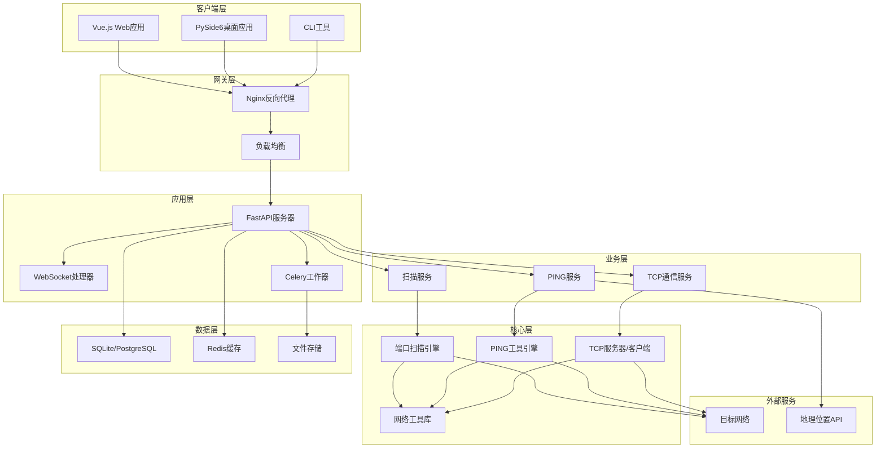

# 设计文档

## 项目概述
- **项目名称**: 网络安全工具平台 (Network Security Platform)
- **架构模式**: 分布式微服务架构 + 前后端分离
- **开发方法论**: 测试驱动开发 (TDD)
- **最后更新**: 2025-05-23

## 系统架构设计

### 总体架构图 (Mermaid)


### 架构分层设计

#### 1. 表示层 (Presentation Layer)
**职责**: 用户交互界面和用户体验
- **Web前端**: Vue.js 3 + TypeScript + Element Plus
- **桌面客户端**: PySide6 + QML
- **命令行界面**: Click + Rich

**设计原则**:
- 响应式设计，支持多端适配
- 组件化开发，提高复用性
- 实时数据更新，WebSocket集成
- 用户体验优先，直观的操作流程

#### 2. API网关层 (API Gateway Layer)
**职责**: 请求路由、负载均衡、安全控制
- **反向代理**: Nginx
- **SSL终止**: Certbot + Let's Encrypt
- **请求限流**: 基于IP和用户的速率限制
- **API版本控制**: v1, v2等版本管理

**设计原则**:
- 单一入口点，统一安全策略
- 高可用性，支持故障转移
- 监控和日志收集
- 缓存静态资源

#### 3. 应用服务层 (Application Service Layer)
**职责**: 业务逻辑编排和API接口提供
- **Web框架**: FastAPI (异步高性能)
- **实时通信**: WebSocket
- **异步任务**: Celery + Redis
- **API文档**: OpenAPI 3.0自动生成

**核心模块**:
```python
# app/main.py - 应用入口
class NetworkPlatformApp:
    def __init__(self):
        self.app = FastAPI(title="网络安全工具平台")
        self.setup_middleware()
        self.setup_routes()
        self.setup_websocket()
    
    def setup_middleware(self):
        # CORS、认证、日志中间件
        pass
    
    def setup_routes(self):
        # API路由注册
        self.app.include_router(scan_router, prefix="/api/v1/scan")
        self.app.include_router(ping_router, prefix="/api/v1/ping")
        self.app.include_router(connection_router, prefix="/api/v1/tcp")
```

#### 4. 业务逻辑层 (Business Logic Layer)
**职责**: 核心业务逻辑实现和数据处理
- **扫描服务**: 端口扫描任务管理和结果处理
- **监控服务**: PING监控和网络质量分析
- **通信服务**: TCP连接管理和消息传递

**设计模式**: 
- **服务模式**: 每个业务域独立的服务类
- **策略模式**: 不同扫描策略的可插拔实现
- **观察者模式**: 实时进度更新和事件通知

#### 5. 核心引擎层 (Core Engine Layer)
**职责**: 网络工具的核心实现
- **端口扫描引擎**: 高性能异步TCP/UDP扫描
- **PING工具引擎**: ICMP协议实现和统计分析
- **TCP通信引擎**: 高并发TCP服务器/客户端

**关键特性**:
- 异步编程，支持高并发
- 自适应速率控制
- 智能错误处理和重试
- 丰富的统计和分析功能

#### 6. 数据持久层 (Data Persistence Layer)
**职责**: 数据存储和访问
- **关系数据库**: SQLite(开发) / PostgreSQL(生产)
- **缓存系统**: Redis (会话、结果缓存)
- **文件存储**: 日志文件、导出数据

## 核心组件设计

### 1. 端口扫描引擎

#### 架构设计
```python
class PortScannerEngine:
    """异步端口扫描引擎
    
    特性:
    - 支持TCP/UDP协议
    - 自适应并发控制
    - 智能服务识别
    - 实时进度回调
    """
    
    def __init__(self, 
                 max_concurrent: int = 100,
                 timeout: float = 3.0,
                 retry_count: int = 1):
        self.semaphore = asyncio.Semaphore(max_concurrent)
        self.timeout = timeout
        self.retry_count = retry_count
        self.progress_callback = None
    
    async def scan_port_range(self,
                            host: str,
                            start_port: int,
                            end_port: int,
                            protocol: str = "tcp") -> List[ScanResult]:
        """扫描端口范围"""
        pass
    
    async def batch_scan(self,
                        targets: List[ScanTarget]) -> Dict[str, List[ScanResult]]:
        """批量扫描多个目标"""
        pass
```

#### 核心算法
1. **自适应并发控制**:
   - 动态调整并发数量
   - 基于网络延迟和错误率
   - 避免目标系统过载

2. **智能服务识别**:
   - Banner grabbing技术
   - 协议特征匹配
   - 版本信息提取

3. **结果聚合算法**:
   - 去重和合并
   - 置信度计算
   - 统计分析

### 2. PING监控引擎

#### 架构设计
```python
class PingEngine:
    """PING监控引擎
    
    特性:
    - ICMP协议实现
    - 连续监控支持
    - 统计分析功能
    - 地理位置集成
    """
    
    def __init__(self,
                 packet_size: int = 64,
                 timeout: float = 5.0,
                 interval: float = 1.0):
        self.packet_size = packet_size
        self.timeout = timeout
        self.interval = interval
        self.statistics = PingStatistics()
    
    async def ping_host(self, host: str, count: int = 4) -> PingResult:
        """单次PING操作"""
        pass
    
    async def continuous_ping(self, 
                            host: str,
                            duration: int = None) -> AsyncGenerator[PingResult]:
        """连续PING监控"""
        pass
```

#### 核心算法
1. **网络质量评估**:
   - RTT分布分析
   - 丢包率计算
   - 抖动检测

2. **异常检测算法**:
   - 统计学方法检测异常值
   - 趋势分析
   - 告警阈值动态调整

3. **路径分析**:
   - Traceroute集成
   - 路径可视化
   - 瓶颈识别

### 3. TCP通信引擎

#### 架构设计
```python
class TCPServer:
    """高性能TCP服务器
    
    特性:
    - 异步并发处理
    - 连接池管理
    - 消息广播支持
    - 自动故障恢复
    """
    
    def __init__(self,
                 host: str = "0.0.0.0",
                 port: int = 8888,
                 max_connections: int = 1000):
        self.host = host
        self.port = port
        self.max_connections = max_connections
        self.clients: Dict[str, ClientConnection] = {}
    
    async def start_server(self) -> None:
        """启动服务器"""
        pass
    
    async def handle_client(self, 
                          reader: StreamReader,
                          writer: StreamWriter) -> None:
        """处理客户端连接"""
        pass

class TCPClient:
    """TCP客户端
    
    特性:
    - 自动重连机制
    - 心跳保活
    - 消息队列缓冲
    - 连接状态监控
    """
    pass
```

#### 核心算法
1. **连接管理**:
   - 连接池复用
   - 自动重连策略
   - 心跳保活机制

2. **消息处理**:
   - 消息队列缓冲
   - 优先级调度
   - 流量控制

## 数据模型设计

### 数据库设计

#### 扫描相关表
```sql
-- 扫描任务表
CREATE TABLE scan_jobs (
    id UUID PRIMARY KEY DEFAULT gen_random_uuid(),
    user_id VARCHAR(36),
    job_name VARCHAR(255) NOT NULL,
    target_hosts JSONB NOT NULL,
    target_ports JSONB NOT NULL,
    scan_type VARCHAR(10) NOT NULL CHECK (scan_type IN ('tcp', 'udp', 'mixed')),
    scan_options JSONB DEFAULT '{}',
    status VARCHAR(20) NOT NULL DEFAULT 'pending' 
        CHECK (status IN ('pending', 'running', 'completed', 'failed', 'cancelled')),
    progress FLOAT DEFAULT 0.0 CHECK (progress >= 0 AND progress <= 100),
    created_at TIMESTAMP WITH TIME ZONE DEFAULT NOW(),
    started_at TIMESTAMP WITH TIME ZONE,
    completed_at TIMESTAMP WITH TIME ZONE,
    error_message TEXT,
    result_summary JSONB
);

-- 扫描结果表
CREATE TABLE scan_results (
    id UUID PRIMARY KEY DEFAULT gen_random_uuid(),
    job_id UUID NOT NULL REFERENCES scan_jobs(id) ON DELETE CASCADE,
    host INET NOT NULL,
    port INTEGER NOT NULL CHECK (port > 0 AND port <= 65535),
    protocol VARCHAR(10) NOT NULL,
    status VARCHAR(20) NOT NULL 
        CHECK (status IN ('open', 'closed', 'filtered', 'error')),
    service_name VARCHAR(100),
    service_version VARCHAR(255),
    banner TEXT,
    response_time FLOAT CHECK (response_time >= 0),
    confidence_level FLOAT DEFAULT 1.0 CHECK (confidence_level >= 0 AND confidence_level <= 1),
    detected_at TIMESTAMP WITH TIME ZONE DEFAULT NOW(),
    UNIQUE(job_id, host, port, protocol)
);

-- 创建索引提高查询性能
CREATE INDEX idx_scan_jobs_status ON scan_jobs(status);
CREATE INDEX idx_scan_jobs_created_at ON scan_jobs(created_at);
CREATE INDEX idx_scan_results_job_id ON scan_results(job_id);
CREATE INDEX idx_scan_results_host_port ON scan_results(host, port);
```

#### PING监控相关表
```sql
-- PING监控任务表
CREATE TABLE ping_jobs (
    id UUID PRIMARY KEY DEFAULT gen_random_uuid(),
    user_id VARCHAR(36),
    job_name VARCHAR(255) NOT NULL,
    target_hosts JSONB NOT NULL,
    ping_options JSONB DEFAULT '{}',
    interval_seconds FLOAT NOT NULL DEFAULT 1.0 CHECK (interval_seconds > 0),
    duration_seconds INTEGER CHECK (duration_seconds > 0),
    status VARCHAR(20) NOT NULL DEFAULT 'pending',
    created_at TIMESTAMP WITH TIME ZONE DEFAULT NOW(),
    started_at TIMESTAMP WITH TIME ZONE,
    stopped_at TIMESTAMP WITH TIME ZONE
);

-- PING结果表  
CREATE TABLE ping_results (
    id UUID PRIMARY KEY DEFAULT gen_random_uuid(),
    job_id UUID NOT NULL REFERENCES ping_jobs(id) ON DELETE CASCADE,
    host INET NOT NULL,
    ip_address INET,
    sequence_number INTEGER NOT NULL,
    ttl INTEGER,
    response_time_ms FLOAT CHECK (response_time_ms >= 0),
    packet_size INTEGER NOT NULL DEFAULT 64,
    success BOOLEAN NOT NULL DEFAULT FALSE,
    error_type VARCHAR(50),
    error_message TEXT,
    timestamp TIMESTAMP WITH TIME ZONE DEFAULT NOW()
);

-- 分区表提高大数据量查询性能
CREATE INDEX idx_ping_results_job_id_timestamp ON ping_results(job_id, timestamp);
CREATE INDEX idx_ping_results_host_timestamp ON ping_results(host, timestamp);
```

### 数据传输对象 (DTO)

#### Pydantic模式设计
```python
from pydantic import BaseModel, Field, validator
from typing import List, Optional, Dict, Any
from datetime import datetime
from enum import Enum
import ipaddress

class ScanType(str, Enum):
    TCP = "tcp"
    UDP = "udp"
    MIXED = "mixed"

class ScanStatus(str, Enum):
    PENDING = "pending"
    RUNNING = "running"
    COMPLETED = "completed"
    FAILED = "failed"
    CANCELLED = "cancelled"

class PortRange(BaseModel):
    """端口范围定义"""
    start: int = Field(..., ge=1, le=65535)
    end: int = Field(..., ge=1, le=65535)
    
    @validator('end')
    def end_must_be_greater_than_start(cls, v, values):
        if 'start' in values and v < values['start']:
            raise ValueError('end port must be greater than or equal to start port')
        return v

class ScanTarget(BaseModel):
    """扫描目标定义"""
    host: str = Field(..., description="目标主机IP或域名")
    ports: List[PortRange] = Field(..., description="要扫描的端口范围列表")
    
    @validator('host')
    def validate_host(cls, v):
        # 验证IP地址或域名格式
        try:
            ipaddress.ip_address(v)
        except ValueError:
            # 如果不是有效IP，验证是否为有效域名
            if not v.replace('.', '').replace('-', '').isalnum():
                raise ValueError('Invalid host format')
        return v

class ScanJobRequest(BaseModel):
    """扫描任务请求"""
    job_name: str = Field(..., min_length=1, max_length=255)
    targets: List[ScanTarget] = Field(..., min_items=1)
    scan_type: ScanType = ScanType.TCP
    options: Dict[str, Any] = Field(default_factory=dict)
    
    class Config:
        schema_extra = {
            "example": {
                "job_name": "内网扫描测试",
                "targets": [
                    {
                        "host": "192.168.1.1",
                        "ports": [
                            {"start": 80, "end": 80},
                            {"start": 443, "end": 443},
                            {"start": 8000, "end": 8100}
                        ]
                    }
                ],
                "scan_type": "tcp",
                "options": {
                    "timeout": 3.0,
                    "max_concurrent": 100,
                    "service_detection": True
                }
            }
        }

class ScanResult(BaseModel):
    """扫描结果"""
    host: str
    port: int = Field(..., ge=1, le=65535)
    protocol: str
    status: str
    service_name: Optional[str] = None
    service_version: Optional[str] = None
    banner: Optional[str] = None
    response_time: Optional[float] = Field(None, ge=0)
    confidence_level: float = Field(1.0, ge=0, le=1)
    detected_at: datetime

class ScanJobResponse(BaseModel):
    """扫描任务响应"""
    job_id: str
    status: ScanStatus
    progress: float = Field(..., ge=0, le=100)
    total_targets: int
    completed_targets: int
    results_count: int
    started_at: Optional[datetime] = None
    estimated_completion: Optional[datetime] = None
    error_message: Optional[str] = None
```

## API接口设计

### RESTful API设计原则

#### 1. 资源导向设计
- 使用名词作为URL路径
- 使用HTTP方法表示操作
- 支持资源嵌套和关联

#### 2. 一致性原则
- 统一的错误响应格式
- 一致的命名约定 (snake_case)
- 标准HTTP状态码使用

#### 3. 版本控制
- URL路径版本 (`/api/v1/`)
- 向后兼容性保证
- 废弃API的渐进式迁移

### 核心API端点设计

#### 扫描相关API
```python
# 创建扫描任务
POST /api/v1/scan/jobs
Content-Type: application/json
{
    "job_name": "端口扫描任务",
    "targets": [...],
    "scan_type": "tcp",
    "options": {...}
}

# 获取扫描任务列表
GET /api/v1/scan/jobs?status=running&limit=20&offset=0

# 获取特定扫描任务
GET /api/v1/scan/jobs/{job_id}

# 获取扫描结果
GET /api/v1/scan/jobs/{job_id}/results?format=json

# 取消扫描任务
DELETE /api/v1/scan/jobs/{job_id}

# 导出扫描结果
GET /api/v1/scan/jobs/{job_id}/export?format=csv
```

#### WebSocket实时通信
```python
# 扫描进度实时更新
WS /ws/scan/{job_id}/progress
{
    "type": "progress_update",
    "job_id": "uuid",
    "progress": 45.2,
    "current_target": "192.168.1.100",
    "completed_targets": 12,
    "total_targets": 50,
    "results_count": 156,
    "estimated_remaining": "00:02:30"
}

# 扫描结果实时推送
WS /ws/scan/{job_id}/results
{
    "type": "new_result",
    "job_id": "uuid",
    "result": {
        "host": "192.168.1.100",
        "port": 80,
        "protocol": "tcp",
        "status": "open",
        "service_name": "http",
        "response_time": 0.025
    }
}
```

## 安全设计

### 认证与授权

#### JWT认证机制
```python
class SecurityConfig:
    JWT_SECRET_KEY = "your-secret-key"
    JWT_ALGORITHM = "HS256"
    JWT_EXPIRE_MINUTES = 60 * 24  # 24小时
    
class JWTHandler:
    @staticmethod
    def create_access_token(user_data: dict) -> str:
        """创建访问令牌"""
        pass
    
    @staticmethod
    def verify_token(token: str) -> Optional[dict]:
        """验证令牌"""
        pass
```

#### API权限控制
```python
from fastapi import Depends, HTTPException, status
from fastapi.security import HTTPBearer

security = HTTPBearer()

async def get_current_user(token: str = Depends(security)):
    """获取当前用户"""
    user_data = JWTHandler.verify_token(token.credentials)
    if not user_data:
        raise HTTPException(
            status_code=status.HTTP_401_UNAUTHORIZED,
            detail="Invalid authentication token"
        )
    return user_data
```

### 输入验证与清理

#### 严格的输入验证
```python
class NetworkValidator:
    @staticmethod
    def validate_ip_address(ip: str) -> bool:
        """验证IP地址格式"""
        try:
            ipaddress.ip_address(ip)
            return True
        except ValueError:
            return False
    
    @staticmethod
    def validate_port_range(start: int, end: int) -> bool:
        """验证端口范围"""
        return 1 <= start <= end <= 65535
    
    @staticmethod
    def sanitize_hostname(hostname: str) -> str:
        """清理主机名输入"""
        # 移除危险字符，防止注入攻击
        import re
        return re.sub(r'[^\w\.\-]', '', hostname)
```

### 速率限制

#### API请求限制
```python
from slowapi import Limiter, _rate_limit_exceeded_handler
from slowapi.util import get_remote_address
from slowapi.errors import RateLimitExceeded

limiter = Limiter(key_func=get_remote_address)

@app.route("/api/v1/scan/jobs")
@limiter.limit("10/minute")  # 每分钟最多10次扫描请求
async def create_scan_job(request: Request):
    pass
```

## 性能优化设计

### 异步编程优化

#### 并发控制策略
```python
class ConcurrencyManager:
    def __init__(self, max_concurrent: int = 100):
        self.semaphore = asyncio.Semaphore(max_concurrent)
        self.active_tasks: Set[asyncio.Task] = set()
    
    async def submit_task(self, coro) -> Any:
        """提交并发任务"""
        async with self.semaphore:
            task = asyncio.create_task(coro)
            self.active_tasks.add(task)
            try:
                result = await task
                return result
            finally:
                self.active_tasks.discard(task)
    
    async def shutdown(self):
        """优雅关闭，等待所有任务完成"""
        if self.active_tasks:
            await asyncio.gather(*self.active_tasks, return_exceptions=True)
```

### 数据库优化

#### 查询优化策略
```python
class DatabaseOptimizer:
    @staticmethod
    async def bulk_insert_results(session: AsyncSession, 
                                 results: List[ScanResult]) -> None:
        """批量插入扫描结果"""
        # 使用批量插入减少数据库往返
        stmt = insert(ScanResultModel).values([
            result.dict() for result in results
        ])
        await session.execute(stmt)
    
    @staticmethod
    async def paginated_query(session: AsyncSession,
                            query: Select,
                            page: int = 1,
                            size: int = 20) -> Tuple[List, int]:
        """分页查询优化"""
        # 计算总数和分页数据
        count_query = select(func.count()).select_from(query.subquery())
        total = await session.scalar(count_query)
        
        offset = (page - 1) * size
        paginated_query = query.offset(offset).limit(size)
        result = await session.execute(paginated_query)
        
        return result.fetchall(), total
```

### 缓存策略

#### Redis缓存设计
```python
class CacheManager:
    def __init__(self, redis_client):
        self.redis = redis_client
        self.default_ttl = 3600  # 1小时
    
    async def cache_scan_results(self, 
                               job_id: str, 
                               results: List[ScanResult]) -> None:
        """缓存扫描结果"""
        key = f"scan_results:{job_id}"
        value = json.dumps([r.dict() for r in results])
        await self.redis.setex(key, self.default_ttl, value)
    
    async def get_cached_results(self, job_id: str) -> Optional[List[ScanResult]]:
        """获取缓存的扫描结果"""
        key = f"scan_results:{job_id}"
        cached = await self.redis.get(key)
        if cached:
            data = json.loads(cached)
            return [ScanResult(**item) for item in data]
        return None
```

## 监控和日志设计

### 结构化日志

#### 日志配置
```python
import structlog

# 配置结构化日志
structlog.configure(
    processors=[
        structlog.stdlib.filter_by_level,
        structlog.stdlib.add_logger_name,
        structlog.stdlib.add_log_level,
        structlog.stdlib.PositionalArgumentsFormatter(),
        structlog.processors.TimeStamper(fmt="iso"),
        structlog.processors.StackInfoRenderer(),
        structlog.processors.format_exc_info,
        structlog.processors.UnicodeDecoder(),
        structlog.processors.JSONRenderer()
    ],
    context_class=dict,
    logger_factory=structlog.stdlib.LoggerFactory(),
    wrapper_class=structlog.stdlib.BoundLogger,
    cache_logger_on_first_use=True,
)

logger = structlog.get_logger(__name__)

# 使用示例
logger.info("Port scan started", 
           job_id=job_id, 
           target_count=len(targets),
           scan_type=scan_type)
```

### 性能监控

#### 指标收集
```python
from prometheus_client import Counter, Histogram, Gauge

# 定义监控指标
SCAN_REQUESTS_TOTAL = Counter('scan_requests_total', 
                             'Total scan requests',
                             ['scan_type', 'status'])

SCAN_DURATION = Histogram('scan_duration_seconds',
                         'Scan duration in seconds',
                         ['scan_type'])

ACTIVE_SCANS = Gauge('active_scans_count',
                    'Number of currently active scans')

# 使用示例
@SCAN_DURATION.time()
async def execute_scan(scan_request: ScanJobRequest):
    ACTIVE_SCANS.inc()
    try:
        # 执行扫描逻辑
        result = await perform_scan(scan_request)
        SCAN_REQUESTS_TOTAL.labels(
            scan_type=scan_request.scan_type,
            status='success'
        ).inc()
        return result
    except Exception as e:
        SCAN_REQUESTS_TOTAL.labels(
            scan_type=scan_request.scan_type,
            status='error'
        ).inc()
        raise
    finally:
        ACTIVE_SCANS.dec()
```

## 部署架构设计

### 容器化策略

#### Docker多阶段构建
```dockerfile
# backend/Dockerfile
FROM python:3.11-slim as base

# 安装系统依赖
RUN apt-get update && apt-get install -y \
    gcc \
    && rm -rf /var/lib/apt/lists/*

# 安装UV
RUN pip install uv

# 开发阶段
FROM base as development
WORKDIR /app
COPY pyproject.toml uv.lock ./
RUN uv sync --dev
COPY . .
CMD ["uv", "run", "uvicorn", "app.main:app", "--host", "0.0.0.0", "--port", "8000", "--reload"]

# 生产阶段
FROM base as production
WORKDIR /app
COPY pyproject.toml uv.lock ./
RUN uv sync --no-dev
COPY . .
RUN uv build
CMD ["uv", "run", "gunicorn", "app.main:app", "-w", "4", "-k", "uvicorn.workers.UvicornWorker", "--bind", "0.0.0.0:8000"]
```

### 高可用部署

#### 负载均衡配置
```nginx
# deployment/nginx/nginx.conf
upstream api_backend {
    least_conn;
    server api-1:8000 weight=1 max_fails=3 fail_timeout=30s;
    server api-2:8000 weight=1 max_fails=3 fail_timeout=30s;
    server api-3:8000 weight=1 max_fails=3 fail_timeout=30s;
}

server {
    listen 443 ssl http2;
    
    # 健康检查
    location /health {
        proxy_pass http://api_backend/health;
        proxy_set_header Host $host;
    }
    
    # API代理
    location /api/ {
        proxy_pass http://api_backend;
        proxy_set_header Host $host;
        proxy_set_header X-Real-IP $remote_addr;
        proxy_set_header X-Forwarded-For $proxy_add_x_forwarded_for;
        proxy_set_header X-Forwarded-Proto $scheme;
        
        # 超时配置
        proxy_connect_timeout 5s;
        proxy_send_timeout 60s;
        proxy_read_timeout 60s;
        
        # 故障转移
        proxy_next_upstream error timeout invalid_header http_500 http_502 http_503;
        proxy_next_upstream_tries 3;
    }
}
```

---
*最后更新: 2025-05-23* 