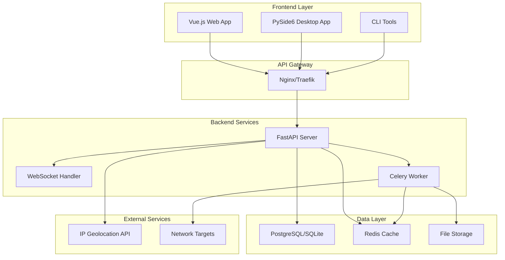
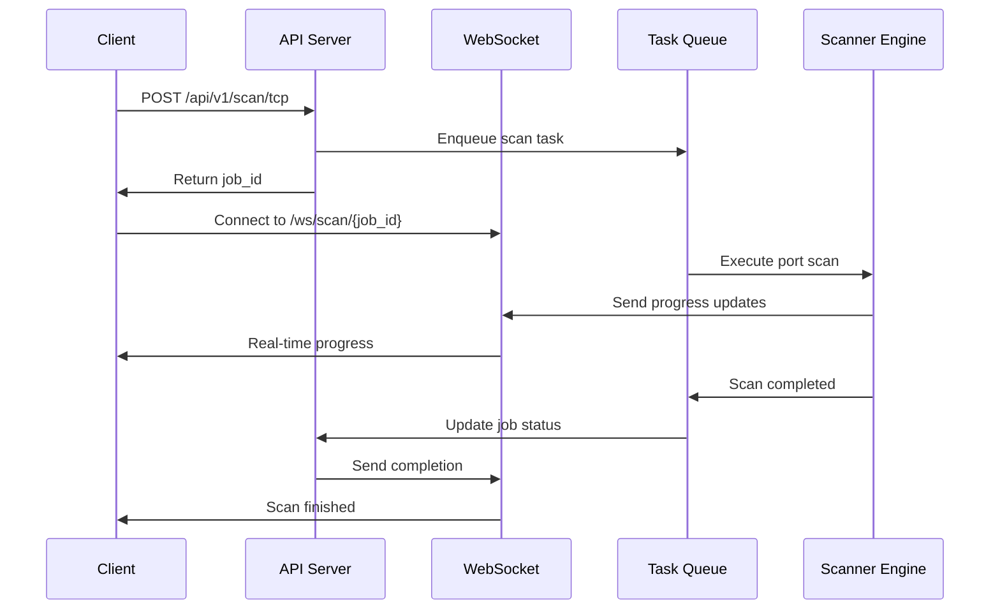

# 网络安全工具平台 - 详细实施计划

## 项目概述

本项目旨在开发一个基于云端部署的现代化网络安全工具平台，满足计算机网络课程设计要求的同时，打造一个功能丰富、技术先进的实用工具集。

### 核心功能模块
1. **多线程端口扫描器** - 智能化TCP/UDP端口扫描工具
2. **网络质量监控器** - 基于PING的网络连通性监控系统  
3. **TCP通信实验室** - 客户端-服务器通信平台

### 技术特色
- 分布式云端架构
- 现代化Web界面
- 实时数据可视化
- 高性能异步编程
- 企业级安全设计
- 完全开源技术栈
- **测试驱动开发 (TDD)**

## 技术选型与架构

### 后端技术栈

#### 核心框架
- **Web框架**: FastAPI 0.104+ (高性能异步API框架)
- **异步运行时**: uvicorn + gunicorn (ASGI服务器)
- **数据库**: SQLite (开发) + PostgreSQL 15+ (生产可选)
- **ORM**: SQLAlchemy 2.0+ (异步支持)
- **任务队列**: Celery + Redis (长时间运行任务)
- **缓存**: Redis 7+ (会话管理和结果缓存)

#### 支撑技术
- **配置管理**: Pydantic Settings
- **日志系统**: structlog + loguru
- **测试框架**: pytest + pytest-asyncio + pytest-cov (支持TDD)
- **API文档**: OpenAPI 3.0 (FastAPI自动生成)
- **实时通信**: WebSocket + Socket.IO

### 前端技术栈

#### 框架与工具
- **主框架**: Vue.js 3 + TypeScript
- **UI组件库**: Element Plus
- **状态管理**: Pinia
- **图表可视化**: ECharts 5+ + Apache Superset (可选)
- **HTTP客户端**: Axios
- **实时通信**: Socket.IO Client
- **构建工具**: Vite
- **样式框架**: Tailwind CSS

### 桌面客户端
- **GUI框架**: PySide6 + QML (开源Qt官方绑定)
- **HTTP客户端**: httpx (异步)
- **配置格式**: TOML
- **图标资源**: Feather Icons / Lucide Icons (开源图标库)

### 项目管理与开发工具

#### Python项目管理
- **包管理器**: uv (超快的Python包管理器，替代pip/pip-tools)
- **虚拟环境**: uv venv (内置虚拟环境管理)
- **工具安装**: pipx (隔离安装Python CLI工具)
- **依赖锁定**: uv.lock (精确依赖版本控制)

#### 代码质量工具
- **代码格式化**: ruff format (替代black，速度更快)
- **代码检查**: ruff check (替代flake8/pylint，功能更全)
- **类型检查**: mypy
- **导入排序**: ruff (内置import sorting)
- **安全扫描**: bandit + safety
- **复杂度分析**: radon
- **测试覆盖率**: pytest-cov + codecov.io

#### 图表与文档生成
- **流程图**: mermaid (文本定义图表，支持流程图、时序图、类图等)
- **架构图**: draw.io (开源在线图表工具) + PlantUML
- **API文档**: FastAPI自动生成 + ReDoc
- **项目文档**: MkDocs + Material主题
- **代码文档**: Sphinx + autodoc

### 部署与运维
- **容器化**: Docker + Docker Compose + Podman (可选)
- **反向代理**: Nginx + Traefik (可选)
- **SSL证书**: Certbot (Let's Encrypt)
- **进程管理**: systemd
- **监控工具**: Prometheus + Grafana + Loki (全开源监控栈)
- **容器安全**: Trivy (容器漏洞扫描)

### CI/CD与自动化
- **CI/CD平台**: GitHub Actions (免费额度充足)
- **代码覆盖率**: codecov.io (通过pytest-cov集成)
- **依赖更新**: Dependabot
- **安全扫描**: CodeQL + Snyk (开源项目免费)
- **容器构建**: Docker BuildKit + multi-stage builds

## 项目目录结构

```
network_security_platform/
├── backend/                    # 后端API服务
│   ├── app/
│   │   ├── __init__.py
│   │   ├── main.py            # FastAPI应用入口
│   │   ├── config.py          # 配置管理
│   │   ├── database.py        # 数据库连接
│   │   ├── models/            # 数据模型
│   │   │   ├── __init__.py
│   │   │   ├── scan.py
│   │   │   ├── ping.py
│   │   │   └── connection.py
│   │   ├── schemas/           # Pydantic模式
│   │   │   ├── __init__.py
│   │   │   ├── scan.py
│   │   │   ├── ping.py
│   │   │   └── connection.py
│   │   ├── api/               # API路由
│   │   │   ├── __init__.py
│   │   │   ├── v1/
│   │   │   │   ├── __init__.py
│   │   │   │   ├── scan.py
│   │   │   │   ├── ping.py
│   │   │   │   ├── connection.py
│   │   │   │   └── websocket.py
│   │   ├── core/              # 核心网络工具
│   │   │   ├── __init__.py
│   │   │   ├── port_scanner.py    # 端口扫描核心
│   │   │   ├── ping_tool.py       # PING工具核心
│   │   │   ├── tcp_server.py      # TCP服务器
│   │   │   ├── tcp_client.py      # TCP客户端
│   │   │   └── network_utils.py   # 网络工具函数
│   │   ├── services/          # 业务逻辑服务
│   │   │   ├── __init__.py
│   │   │   ├── scan_service.py
│   │   │   ├── ping_service.py
│   │   │   └── connection_service.py
│   │   ├── utils/             # 工具函数
│   │   │   ├── __init__.py
│   │   │   ├── logger.py
│   │   │   ├── security.py
│   │   │   └── validators.py
│   │   └── tasks/             # Celery任务
│   │       ├── __init__.py
│   │       ├── scan_tasks.py
│   │       └── ping_tasks.py
│   ├── alembic/               # 数据库迁移
│   ├── tests/                 # 后端测试 (遵循TDD)
│   ├── pyproject.toml         # UV项目配置文件
│   ├── uv.lock               # UV锁定文件
│   ├── Dockerfile
│   └── docker-compose.yml
├── frontend/                  # Vue.js前端
│   ├── public/
│   ├── src/
│   │   ├── components/        # Vue组件
│   │   │   ├── common/
│   │   │   ├── scan/
│   │   │   ├── ping/
│   │   │   └── connection/
│   │   ├── views/             # 页面视图
│   │   │   ├── Dashboard.vue
│   │   │   ├── ScanTools.vue
│   │   │   ├── PingMonitor.vue
│   │   │   └── ConnectionLab.vue
│   │   ├── stores/            # Pinia状态管理
│   │   ├── api/               # API调用
│   │   ├── utils/
│   │   ├── router/
│   │   ├── App.vue
│   │   └── main.ts
│   ├── package.json
│   ├── vite.config.ts
│   ├── tsconfig.json
│   └── Dockerfile
├── desktop_client/            # PySide6桌面客户端
│   ├── src/
│   │   ├── main.py
│   │   ├── ui/
│   │   │   ├── main_window.py
│   │   │   ├── scan_widget.py
│   │   │   ├── ping_widget.py
│   │   │   └── connection_widget.py
│   │   ├── qml/               # QML界面文件
│   │   │   ├── main.qml
│   │   │   ├── ScanView.qml
│   │   │   ├── PingView.qml
│   │   │   └── ConnectionView.qml
│   │   ├── api/               # API客户端
│   │   ├── models/
│   │   └── utils/
│   ├── resources/             # 图标和资源文件
│   ├── tests/                 # 桌面客户端测试 (遵循TDD)
│   ├── pyproject.toml
│   └── build.py
├── cli_tools/                 # 命令行工具
│   ├── network_scanner.py
│   ├── ping_monitor.py
│   ├── tcp_tools.py
│   ├── tests/                 # CLI工具测试 (遵循TDD)
│   └── pyproject.toml
├── deployment/                # 部署配置
│   ├── nginx/
│   │   └── nginx.conf
│   ├── traefik/               # Traefik配置(可选)
│   │   └── traefik.yml
│   ├── systemd/
│   │   ├── network-platform-api.service
│   │   └── network-platform-worker.service
│   ├── docker/
│   │   ├── docker-compose.prod.yml
│   │   └── docker-compose.dev.yml
│   ├── monitoring/            # 监控配置
│   │   ├── prometheus.yml
│   │   ├── grafana/
│   │   └── loki/
│   └── scripts/
│       ├── deploy.sh
│       ├── backup.sh
│       ├── update.sh
│       └── security-scan.sh
├── docs/                      # 项目文档
│   ├── mkdocs.yml            # MkDocs配置
│   ├── docs/
│   │   ├── index.md
│   │   ├── api/              # API文档
│   │   ├── deployment/       # 部署文档
│   │   ├── user_guide/       # 用户指南
│   │   └── development/      # 开发文档 (包含TDD流程)
│   └── diagrams/             # Mermaid图表文件
│       ├── architecture.md   # 架构图
│       ├── flows/           # 流程图
│       ├── sequences/       # 时序图
│       └── classes/         # 类图
├── tests/                     # 集成测试 (遵循TDD)
├── logs/                      # 日志目录
├── data/                      # 数据目录
├── config/                    # 配置文件
│   ├── development.toml
│   ├── production.toml
│   └── test.toml
├── .github/                   # GitHub Actions工作流
│   ├── workflows/
│   │   ├── ci.yml            # 持续集成 (包含TDD步骤)
│   │   ├── cd.yml            # 持续部署
│   │   ├── security.yml      # 安全扫描
│   │   └── docs.yml          # 文档部署
│   └── dependabot.yml       # 依赖更新配置
├── .vscode/                   # VS Code配置
│   ├── settings.json
│   ├── tasks.json
│   └── extensions.json
├── Structure.md               # 项目结构文档
├── Thread.md                  # 任务进程文档
├── Design.md                  # 设计文档
├── Log.md                     # 变更日志索引
├── Issues.md                  # 问题追踪
├── Diagram.md                 # 绘图日志索引
├── Plan.md                    # 本计划文档
├── README.md                  # 项目说明
├── CONTRIBUTING.md            # 贡献指南
├── SECURITY.md               # 安全政策
├── LICENSE                   # 开源许可证
├── pyproject.toml            # 根项目配置
├── uv.lock                   # UV全局锁定文件
├── .gitignore
├── .ruff.toml               # Ruff配置
├── mypy.ini                 # MyPy配置
├── .pre-commit-config.yaml  # Pre-commit钩子
└── docker-compose.yml        # 开发环境
```

## 核心功能模块设计

### 1. 端口扫描器模块

#### 核心类设计
```python
class PortScannerEngine:
    def __init__(self, max_threads: int = 100, timeout: float = 3.0)
    async def scan_tcp_port(self, host: str, port: int) -> ScanResult
    async def scan_udp_port(self, host: str, port: int) -> ScanResult
    async def scan_port_range(self, host: str, start_port: int, end_port: int, protocol: str) -> List[ScanResult]
    async def batch_scan_hosts(self, hosts: List[str], ports: List[int]) -> Dict[str, List[ScanResult]]
    async def service_detection(self, host: str, port: int) -> ServiceInfo
    def generate_scan_report(self, results: List[ScanResult]) -> ScanReport

class ScanResult:
    host: str
    port: int
    protocol: str
    status: str  # "open", "closed", "filtered"
    service: Optional[str]
    banner: Optional[str]
    response_time: float
    timestamp: datetime
```

#### 高级功能
- 自适应扫描速率控制
- 智能服务指纹识别
- 基于响应时间的超时调整
- 扫描结果聚合和分析
- 实时进度回调机制

### 2. PING工具模块

#### 核心类设计
```python
class PingEngine:
    def __init__(self, count: int = 4, timeout: float = 5.0, interval: float = 1.0)
    async def ping_host(self, host: str) -> PingResult
    async def continuous_ping(self, host: str, callback: Callable) -> AsyncGenerator[PingResult]
    async def batch_ping(self, hosts: List[str]) -> Dict[str, PingResult]
    async def traceroute(self, host: str, max_hops: int = 30) -> TracerouteResult
    def calculate_statistics(self, results: List[PingResult]) -> PingStatistics

class PingResult:
    host: str
    ip_address: str
    sequence: int
    ttl: int
    time: float
    packet_size: int
    timestamp: datetime
    success: bool
    error_message: Optional[str]
```

#### 高级功能
- 地理位置信息集成
- 网络质量评估算法
- 历史数据趋势分析
- 异常检测和告警
- 路径跟踪可视化

### 3. TCP通信模块

#### 服务器端设计
```python
class TCPServer:
    def __init__(self, host: str = "0.0.0.0", port: int = 8888)
    async def start_server(self) -> None
    async def handle_client(self, reader: StreamReader, writer: StreamWriter) -> None
    async def broadcast_message(self, message: str, exclude_client: Optional[str] = None) -> None
    def add_client(self, client_id: str, writer: StreamWriter) -> None
    def remove_client(self, client_id: str) -> None
    async def get_server_stats(self) -> ServerStats
```

#### 客户端设计
```python
class TCPClient:
    def __init__(self, server_host: str, server_port: int)
    async def connect(self) -> bool
    async def send_message(self, message: str) -> bool
    async def receive_messages(self, callback: Callable) -> None
    async def disconnect(self) -> None
    def get_connection_status(self) -> ConnectionStatus
```

#### 高级功能
- 多客户端聊天室
- 文件传输支持
- 端到端加密通信
- 连接池管理
- 负载均衡机制

## 项目配置文件

### UV项目配置 (pyproject.toml)
```toml
[project]
name = "network-security-platform"
version = "0.1.0"
description = "现代化网络安全工具平台"
authors = [
    {name = "Your Name", email = "your.email@example.com"}
]
dependencies = [
    "fastapi>=0.104.0",
    "uvicorn[standard]>=0.24.0",
    "sqlalchemy[asyncio]>=2.0.0",
    "pydantic>=2.5.0",
    "redis>=5.0.0",
    "celery>=5.3.0",
    "httpx>=0.25.0",
    "loguru>=0.7.0",
    "structlog>=23.2.0",
]
requires-python = ">=3.11"
readme = "README.md"
license = {text = "MIT"}

[project.optional-dependencies]
dev = [
    "pytest>=7.4.0",
    "pytest-asyncio>=0.21.0",
    "pytest-cov>=4.1.0",
    "ruff>=0.1.0",
    "mypy>=1.7.0",
    "bandit>=1.7.0",
    "safety>=2.3.0",
    "pre-commit>=3.5.0",
]
desktop = [
    "PySide6>=6.6.0",
    "PySide6-Addons>=6.6.0",
]
docs = [
    "mkdocs>=1.5.0",
    "mkdocs-material>=9.4.0",
    "mkdocs-mermaid2-plugin>=1.1.0",
]

[build-system]
requires = ["hatchling"]
build-backend = "hatchling.build"

[tool.ruff]
target-version = "py311"
line-length = 88
select = [
    "E",  # pycodestyle errors
    "W",  # pycodestyle warnings
    "F",  # pyflakes
    "I",  # isort
    "B",  # flake8-bugbear
    "C4", # flake8-comprehensions
    "N",  # pep8-naming
    "UP", # pyupgrade
]
ignore = [
    "E501",  # line too long, handled by black
    "B008",  # do not perform function calls in argument defaults
]

[tool.ruff.per-file-ignores]
"__init__.py" = ["F401"]
"tests/**/*.py" = ["S101", "S301"]

[tool.mypy]
python_version = "3.11"
check_untyped_defs = true
disallow_any_generics = true
disallow_incomplete_defs = true
disallow_untyped_defs = true
no_implicit_optional = true
warn_redundant_casts = true
warn_unused_ignores = true

[tool.pytest.ini_options]
minversion = "7.0"
addopts = "-ra -q --cov=app --cov-report=term-missing --cov-report=html"
testpaths = ["tests", "backend/tests", "cli_tools/tests", "desktop_client/tests"] # TDD: Include all test paths
python_files = ["test_*.py", "*_test.py"]
python_classes = ["Test*"]
python_functions = ["test_*"]

[tool.coverage.run]
source = ["app", "cli_tools", "desktop_client/src"] # TDD: Include all source paths for coverage
omit = ["*/tests/*", "*/venv/*", "*/__pycache__/*"]

[tool.coverage.report]
exclude_lines = [
    "pragma: no cover",
    "def __repr__",
    "raise AssertionError",
    "raise NotImplementedError",
]
```

### Ruff配置 (.ruff.toml)
```toml
# 扩展Ruff配置
[extend-per-file-ignores]
"migrations/**/*.py" = ["E501"]
"scripts/**/*.py" = ["T201"]
```

## 图表与文档系统

### Mermaid图表集成

#### 架构图示例


#### 流程图示例


### MkDocs文档配置

#### mkdocs.yml
```yaml
site_name: 网络安全工具平台
site_description: 现代化网络安全工具平台文档
site_author: Your Name
site_url: https://your-domain.com

theme:
  name: material
  language: zh
  palette:
    - scheme: default
      primary: indigo
      accent: indigo
      toggle:
        icon: material/brightness-7
        name: Switch to dark mode
    - scheme: slate
      primary: indigo
      accent: indigo
      toggle:
        icon: material/brightness-4
        name: Switch to light mode
  features:
    - navigation.tabs
    - navigation.sections
    - navigation.expand
    - navigation.top
    - search.highlight
    - search.share
    - toc.follow

plugins:
  - search:
      lang: zh
  - mermaid2:
      arguments:
        theme: auto

markdown_extensions:
  - pymdownx.highlight:
      anchor_linenums: true
  - pymdownx.inlinehilite
  - pymdownx.snippets
  - pymdownx.superfences:
      custom_fences:
        - name: mermaid
          class: mermaid
          format: !!python/name:pymdownx.superfences.fence_code_format
  - admonition
  - pymdownx.details
  - pymdownx.tabbed:
      alternate_style: true

nav:
  - 首页: index.md
  - 快速开始:
    - 安装指南: user_guide/installation.md
    - 基础使用: user_guide/basic_usage.md
  - API文档:
    - 扫描API: api/scan.md
    - PING API: api/ping.md
    - 连接API: api/connection.md
  - 部署指南:
    - 开发环境: deployment/development.md
    - 生产环境: deployment/production.md
    - Docker部署: deployment/docker.md
  - 开发文档:
    - 项目架构: development/architecture.md
    - 代码规范: development/coding_standards.md
    - 测试指南: development/testing.md # TDD相关内容
    - TDD开发流程: development/tdd_workflow.md
```

## CI/CD配置

### GitHub Actions工作流

#### 持续集成 (.github/workflows/ci.yml)
```yaml
name: CI

on:
  push:
    branches: [ main, develop ]
  pull_request:
    branches: [ main ]

jobs:
  test:
    runs-on: ubuntu-latest
    strategy:
      matrix:
        python-version: ["3.11", "3.12"]
    
    steps:
    - uses: actions/checkout@v4
    
    - name: Install uv
      uses: astral-sh/setup-uv@v1
      with:
        version: "latest"
    
    - name: Set up Python ${{ matrix.python-version }}
      run: uv python install ${{ matrix.python-version }}
    
    - name: Install dependencies
      run: |
        uv sync --dev
        uv pip install --system .
    
    - name: Run ruff
      run: uv run ruff check .
    
    - name: Run ruff format
      run: uv run ruff format --check .
    
    - name: Run mypy
      run: uv run mypy .
    
    - name: Run bandit
      run: uv run bandit -r app/
    
    - name: Run tests (TDD)
      run: uv run pytest --cov=app --cov-report=xml
    
    - name: Upload coverage
      uses: codecov/codecov-action@v3
      with:
        file: ./coverage.xml

  security:
    runs-on: ubuntu-latest
    steps:
    - uses: actions/checkout@v4
    
    - name: Run Trivy vulnerability scanner
      uses: aquasecurity/trivy-action@master
      with:
        scan-type: 'fs'
        scan-ref: '.'
        format: 'sarif'
        output: 'trivy-results.sarif'
    
    - name: Upload Trivy scan results
      uses: github/codeql-action/upload-sarif@v2
      with:
        sarif_file: 'trivy-results.sarif'
```

#### 文档部署 (.github/workflows/docs.yml)
```yaml
name: Deploy Documentation

on:
  push:
    branches: [ main ]
    paths: [ 'docs/**' ]

jobs:
  deploy:
    runs-on: ubuntu-latest
    steps:
    - uses: actions/checkout@v4
    
    - name: Install uv
      uses: astral-sh/setup-uv@v1
    
    - name: Set up Python
      run: uv python install 3.11
    
    - name: Install dependencies
      run: uv sync --group docs
    
    - name: Deploy to GitHub Pages
      run: uv run mkdocs gh-deploy --force
```

## 安全配置增强

### Pre-commit钩子配置
```yaml
# .pre-commit-config.yaml
repos:
  - repo: https://github.com/astral-sh/ruff-pre-commit
    rev: v0.1.6
    hooks:
      - id: ruff
        args: [--fix]
      - id: ruff-format
  
  - repo: https://github.com/pre-commit/pre-commit-hooks
    rev: v4.5.0
    hooks:
      - id: trailing-whitespace
      - id: end-of-file-fixer
      - id: check-yaml
      - id: check-added-large-files
      - id: check-merge-conflict
  
  - repo: https://github.com/PyCQA/bandit
    rev: 1.7.5
    hooks:
      - id: bandit
        args: ["-r", "app/"]
  
  - repo: https://github.com/gitguardian/ggshield
    rev: v1.25.0
    hooks:
      - id: ggshield
        language: python
        stages: [commit]
```

### 容器安全扫描脚本
```bash
#!/bin/bash
# deployment/scripts/security-scan.sh

echo "🔍 开始安全扫描..."

# 1. 依赖漏洞扫描
echo "📦 扫描Python依赖漏洞..."
uv run safety check
uv run pip-audit

# 2. 代码安全扫描
echo "🔐 扫描代码安全问题..."
uv run bandit -r app/ -f json -o bandit-report.json

# 3. 容器镜像扫描
echo "🐳 扫描Docker镜像漏洞..."
trivy image --security-checks vuln,config network-platform:latest

# 4. 基础设施配置扫描
echo "⚙️ 扫描基础设施配置..."
trivy config deployment/

echo "✅ 安全扫描完成！"
```

## 性能分析与监控

### 性能分析工具配置
```python
# app/utils/performance.py
import time
import psutil
import asyncio
from functools import wraps
from typing import Callable, Any
import structlog

logger = structlog.get_logger()

def performance_monitor(func: Callable) -> Callable:
    """性能监控装饰器"""
    @wraps(func)
    async def async_wrapper(*args, **kwargs) -> Any:
        start_time = time.time()
        start_memory = psutil.Process().memory_info().rss
        
        try:
            result = await func(*args, **kwargs)
            return result
        finally:
            end_time = time.time()
            end_memory = psutil.Process().memory_info().rss
            
            logger.info(
                "Performance metrics",
                function=func.__name__,
                duration=end_time - start_time,
                memory_delta=end_memory - start_memory,
                cpu_percent=psutil.cpu_percent(),
            )
    
    @wraps(func)
    def sync_wrapper(*args, **kwargs) -> Any:
        start_time = time.time()
        start_memory = psutil.Process().memory_info().rss
        
        try:
            result = func(*args, **kwargs)
            return result
        finally:
            end_time = time.time()
            end_memory = psutil.Process().memory_info().rss
            
            logger.info(
                "Performance metrics",
                function=func.__name__,
                duration=end_time - start_time,
                memory_delta=end_memory - start_memory,
                cpu_percent=psutil.cpu_percent(),
            )
    
    if asyncio.iscoroutinefunction(func):
        return async_wrapper
    else:
        return sync_wrapper
```

## API接口设计

### 扫描API端点
```python
# 扫描相关API
POST /api/v1/scan/tcp          # 启动TCP扫描
POST /api/v1/scan/udp          # 启动UDP扫描
GET  /api/v1/scan/{job_id}/status     # 获取扫描状态
GET  /api/v1/scan/{job_id}/results    # 获取扫描结果
DELETE /api/v1/scan/{job_id}          # 取消扫描任务
```

### PING API端点
```python
# PING相关API
POST /api/v1/ping/single       # 单次PING
POST /api/v1/ping/batch        # 批量PING
POST /api/v1/ping/monitor      # 启动监控
GET  /api/v1/ping/monitor/{job_id}/stats  # 获取统计信息
```

### 连接API端点
```python
# TCP连接相关API
POST /api/v1/tcp/server/start  # 启动TCP服务器
POST /api/v1/tcp/client/connect    # 连接TCP服务器
POST /api/v1/tcp/send          # 发送消息
GET  /api/v1/tcp/server/{server_id}/stats  # 获取服务器统计
```

### WebSocket端点
```python
# 实时通信端点
WS   /ws/scan/{job_id}         # 扫描进度推送
WS   /ws/ping/{job_id}         # PING结果推送
WS   /ws/tcp/{session_id}      # TCP消息推送
```

## 数据库设计

### 扫描相关表
```sql
-- 扫描任务表
CREATE TABLE scan_jobs (
    id VARCHAR(36) PRIMARY KEY,
    user_id VARCHAR(36),
    target_hosts JSON,
    target_ports JSON,
    scan_type VARCHAR(10),
    status VARCHAR(20),
    created_at TIMESTAMP,
    started_at TIMESTAMP,
    completed_at TIMESTAMP,
    progress FLOAT DEFAULT 0.0
);

-- 扫描结果表
CREATE TABLE scan_results (
    id VARCHAR(36) PRIMARY KEY,
    job_id VARCHAR(36) REFERENCES scan_jobs(id),
    host VARCHAR(255),
    port INTEGER,
    protocol VARCHAR(10),
    status VARCHAR(20),
    service VARCHAR(100),
    banner TEXT,
    response_time FLOAT,
    timestamp TIMESTAMP
);
```

### PING相关表
```sql
-- PING任务表
CREATE TABLE ping_jobs (
    id VARCHAR(36) PRIMARY KEY,
    target_hosts JSON,
    interval FLOAT,
    duration INTEGER,
    status VARCHAR(20),
    created_at TIMESTAMP
);

-- PING结果表
CREATE TABLE ping_results (
    id VARCHAR(36) PRIMARY KEY,
    job_id VARCHAR(36) REFERENCES ping_jobs(id),
    host VARCHAR(255),
    ip_address VARCHAR(45),
    sequence INTEGER,
    ttl INTEGER,
    response_time FLOAT,
    packet_size INTEGER,
    success BOOLEAN,
    timestamp TIMESTAMP
);
```

## 前端界面设计

### 主要页面组件

#### 1. 仪表板页面 (Dashboard.vue)
- 系统状态概览
- 最近任务统计
- 实时性能监控
- 快速操作入口

#### 2. 扫描工具页面 (ScanTools.vue)
- 扫描目标配置面板
- 扫描参数设置
- 实时进度显示
- 结果表格和图表
- 导出功能

#### 3. PING监控页面 (PingMonitor.vue)
- 目标主机配置
- 监控参数设置
- 实时延迟图表
- 统计信息面板
- 历史数据查看

#### 4. 连接实验室页面 (ConnectionLab.vue)
- 服务器启动控制
- 客户端连接管理
- 消息收发界面
- 连接状态监控

### 响应式设计
- 支持桌面、平板、手机访问
- 自适应布局
- 触摸友好的操作界面

## 部署架构

### 云服务器配置
- **服务器**: 腾讯云 Ubuntu 22.04 LTS
- **公网IP**: 124.221.188.46
- **内网IP**: 10.0.4.9
- **配置**: 2核CPU, 2GB内存, 50GB硬盘

### 容器化部署
```yaml
# docker-compose.prod.yml
version: '3.8'
services:
  nginx:
    image: nginx:alpine
    ports:
      - "80:80"
      - "443:443"
    volumes:
      - ./deployment/nginx/nginx.conf:/etc/nginx/nginx.conf
      - ./ssl:/etc/nginx/ssl
    depends_on:
      - api
      - frontend
  
  api:
    build: ./backend
    environment:
      - ENVIRONMENT=production
      - DATABASE_URL=sqlite:///./data/production.db
      - REDIS_URL=redis://redis:6379
    volumes:
      - ./logs:/app/logs
      - ./data:/app/data
    depends_on:
      - redis
    healthcheck:
      test: ["CMD", "curl", "-f", "http://localhost:8000/health"]
      interval: 30s
      timeout: 10s
      retries: 3
  
  worker:
    build: ./backend
    command: celery -A app.tasks worker --loglevel=info
    environment:
      - ENVIRONMENT=production
      - REDIS_URL=redis://redis:6379
    depends_on:
      - redis
    healthcheck:
      test: ["CMD", "celery", "inspect", "ping"]
      interval: 30s
      timeout: 10s
      retries: 3
  
  redis:
    image: redis:alpine
    volumes:
      - redis_data:/data
    healthcheck:
      test: ["CMD", "redis-cli", "ping"]
      interval: 30s
      timeout: 10s
      retries: 3
  
  frontend:
    build: ./frontend
    environment:
      - NODE_ENV=production
      - VITE_API_BASE_URL=https://124.221.188.46/api
  
  # 监控服务
  prometheus:
    image: prom/prometheus
    ports:
      - "9090:9090"
    volumes:
      - ./deployment/monitoring/prometheus.yml:/etc/prometheus/prometheus.yml
      - prometheus_data:/prometheus
  
  grafana:
    image: grafana/grafana
    ports:
      - "3001:3000"
    volumes:
      - grafana_data:/var/lib/grafana
      - ./deployment/monitoring/grafana:/etc/grafana/provisioning
    environment:
      - GF_SECURITY_ADMIN_PASSWORD=admin

volumes:
  redis_data:
  prometheus_data:
  grafana_data:
```

### Nginx配置
```nginx
# deployment/nginx/nginx.conf
upstream api_backend {
    server api:8000;
}

upstream frontend_backend {
    server frontend:3000;
}

server {
    listen 80;
    server_name 124.221.188.46;
    return 301 https://$server_name$request_uri;
}

server {
    listen 443 ssl http2;
    server_name 124.221.188.46;
    
    ssl_certificate /etc/nginx/ssl/cert.pem;
    ssl_certificate_key /etc/nginx/ssl/key.pem;
    ssl_protocols TLSv1.2 TLSv1.3;
    ssl_ciphers ECDHE-RSA-AES256-GCM-SHA512:DHE-RSA-AES256-GCM-SHA512:ECDHE-RSA-AES256-GCM-SHA384:DHE-RSA-AES256-GCM-SHA384:ECDHE-RSA-AES256-SHA384;
    
    # 安全头
    add_header X-Frame-Options DENY;
    add_header X-Content-Type-Options nosniff;
    add_header X-XSS-Protection "1; mode=block";
    add_header Strict-Transport-Security "max-age=31536000; includeSubDomains";
    
    # API代理
    location /api/ {
        proxy_pass http://api_backend;
        proxy_set_header Host $host;
        proxy_set_header X-Real-IP $remote_addr;
        proxy_set_header X-Forwarded-For $proxy_add_x_forwarded_for;
        proxy_set_header X-Forwarded-Proto $scheme;
        
        # 限制请求速率
        limit_req zone=api burst=20 nodelay;
    }
    
    # WebSocket代理
    location /ws/ {
        proxy_pass http://api_backend;
        proxy_http_version 1.1;
        proxy_set_header Upgrade $http_upgrade;
        proxy_set_header Connection "upgrade";
        proxy_set_header Host $host;
        proxy_set_header X-Real-IP $remote_addr;
        proxy_set_header X-Forwarded-For $proxy_add_x_forwarded_for;
        proxy_set_header X-Forwarded-Proto $scheme;
    }
    
    # 前端代理
    location / {
        proxy_pass http://frontend_backend;
        proxy_set_header Host $host;
        proxy_set_header X-Real-IP $remote_addr;
        proxy_set_header X-Forwarded-For $proxy_add_x_forwarded_for;
        proxy_set_header X-Forwarded-Proto $scheme;
    }
    
    # 静态文件缓存
    location ~* \.(js|css|png|jpg|jpeg|gif|ico|svg)$ {
        proxy_pass http://frontend_backend;
        expires 1y;
        add_header Cache-Control "public, immutable";
    }
}

# 限制请求速率
http {
    limit_req_zone $binary_remote_addr zone=api:10m rate=10r/s;
}
```

## 安全设计

### 网络安全
- **防火墙规则**: UFW配置，仅开放必要端口
- **SSL/TLS加密**: HTTPS强制访问
- **API安全**: JWT认证，请求速率限制
- **输入验证**: 严格的参数校验和清理

### 应用安全
- **权限控制**: 基于角色的访问控制
- **审计日志**: 完整的操作记录
- **数据加密**: 敏感数据加密存储
- **安全头**: CSP、HSTS等安全响应头

### 运维安全
- **定期备份**: 自动化数据备份
- **更新管理**: 及时的安全补丁更新
- **监控告警**: 异常行为检测和通知
- **故障恢复**: 快速恢复机制

## 测试策略

### 测试驱动开发 (TDD)
- **核心方法论**: 遵循红-绿-重构（Red-Green-Refactor）的TDD循环。
- **测试先行**: 在编写任何功能代码之前，先为其编写失败的测试用例。
- **小步快跑**: 每次只编写刚好能让测试通过的最小化代码。
- **持续重构**: 在测试通过后，优化代码结构和可读性，确保测试依然通过。

### 单元测试
- **覆盖率目标**: >90% (TDD有助于实现高覆盖率)
- **测试框架**: pytest + pytest-asyncio + pytest-cov
- **测试范围**: 核心算法、网络功能、API端点、工具函数

### 集成测试
- **API测试**: 完整的请求-响应测试，验证各组件协同工作。
- **数据库测试**: 数据持久化与一致性验证。
- **WebSocket测试**: 实时通信功能验证。

### 性能测试
- **负载测试**: locust + k6
- **压力测试**: 系统极限测试
- **网络性能**: 扫描速度和准确性测试

### 安全测试
- **渗透测试**: OWASP ZAP + 基础安全漏洞检查
- **输入验证**: 恶意输入防护测试
- **认证测试**: 权限控制验证

## 监控和运维

### 应用监控
- **健康检查**: `/health` 端点监控
- **性能指标**: 响应时间、吞吐量监控
- **错误跟踪**: 异常日志聚合分析
- **业务指标**: 扫描任务成功率统计

### 系统监控
- **资源监控**: CPU、内存、磁盘使用率
- **网络监控**: 连接数、带宽使用
- **进程监控**: 服务进程状态检查
- **日志监控**: 系统和应用日志分析

### 告警机制
- **阈值告警**: 资源使用超限通知
- **故障告警**: 服务异常即时通知
- **性能告警**: 响应时间异常提醒
- **安全告警**: 异常访问模式检测

## 文档和培训

### 用户文档
- **快速入门指南**: 基础功能使用说明
- **功能详解**: 各模块详细使用教程
- **API文档**: 完整的接口说明
- **FAQ**: 常见问题解答

### 开发文档
- **架构说明**: 系统设计文档
- **部署指南**: 环境搭建和部署流程
- **维护手册**: 运维操作指南
- **扩展指南**: 功能扩展开发说明
- **TDD开发流程**: 测试驱动开发实践指南

## 项目时间规划

### 第一阶段：基础架构 (1-2周)
1. 项目结构初始化和UV配置
2. **TDD**: 为核心网络工具编写初始测试用例
3. 核心网络工具开发 (遵循TDD)
4. **TDD**: 为基础API框架编写测试用例
5. 基础API框架搭建 (遵循TDD)
6. 数据库设计和实现
7. 基础前端框架搭建
8. CI/CD流水线配置 (集成TDD测试步骤)

### 第二阶段：核心功能 (2-3周)
1. **TDD**: 为端口扫描器编写测试用例
2. 端口扫描器完整实现 (遵循TDD)
3. **TDD**: 为PING工具编写测试用例
4. PING工具完整实现 (遵循TDD)
5. **TDD**: 为TCP通信模块编写测试用例
6. TCP通信模块完整实现 (遵循TDD)
7. 前端界面开发
8. 实时功能集成
9. PySide6桌面客户端基础

### 第三阶段：高级功能 (1-2周)
1. 数据可视化实现
2. 桌面客户端功能完善 (遵循TDD)
3. 高级分析功能 (遵循TDD)
4. 性能优化
5. 安全加固
6. 监控系统集成

### 第四阶段：部署上线 (1周)
1. 生产环境配置
2. 容器化部署
3. 监控系统搭建
4. 最终性能测试和调优
5. 文档完善和发布

## 成功指标

### 功能指标
- ✅ 所有三个核心模块功能完整
- ✅ Web界面美观易用
- ✅ PySide6桌面客户端正常运行
- ✅ API文档完整准确
- ✅ 部署环境稳定运行

### 技术指标
- ✅ **TDD实践**: 项目大部分模块遵循TDD流程开发
- ✅ 测试覆盖率 >90%
- ✅ API响应时间 <500ms
- ✅ 并发扫描支持 >100线程
- ✅ 系统可用性 >99%
- ✅ 安全漏洞零风险

### 用户体验指标
- ✅ 界面响应速度快
- ✅ 操作流程直观
- ✅ 错误提示友好
- ✅ 帮助文档完善
- ✅ 移动端兼容良好

### 开发体验指标
- ✅ UV项目管理高效
- ✅ 代码质量工具完善
- ✅ CI/CD流水线稳定 (TDD集成)
- ✅ 文档自动化生成
- ✅ 开发环境一致性

## 风险评估与应对

### 技术风险
- **网络权限**: PING功能可能需要管理员权限
  - 应对：提供降权替代方案，使用第三方库如`ping3`
- **性能瓶颈**: 大规模扫描可能影响服务器性能
  - 应对：智能限流，异步任务处理，UV优化依赖管理
- **兼容性**: 不同操作系统的网络API差异
  - 应对：跨平台测试，抽象网络接口

### 安全风险
- **网络攻击**: 扫描功能可能被恶意利用
  - 应对：访问控制，使用限制，审计日志，Trivy容器扫描
- **数据泄露**: 扫描结果包含敏感信息
  - 应对：数据加密，权限控制，定期清理

### 时间风险
- **功能复杂度**: 高级功能开发时间可能超预期
  - 应对：MVP优先，分阶段交付，核心功能优先
- **TDD上手曲线**: 团队成员可能需要时间适应TDD流程
  - 应对：提供TDD培训和示例，结对编程，从小功能开始实践

### 依赖风险
- **开源依赖**: 第三方包的安全性和稳定性
  - 应对：UV锁定依赖版本，定期安全扫描，Dependabot自动更新

## 补充内容

### 开发环境一致性
- **容器开发**: 使用Dev Containers确保环境一致
- **环境变量**: 使用`.env`文件管理本地配置
- **数据库种子**: 提供测试数据初始化脚本
- **Mock服务**: 为外部API提供Mock服务

### 可观测性增强
- **分布式追踪**: OpenTelemetry集成
- **结构化日志**: 使用structlog统一日志格式
- **指标收集**: Prometheus metrics集成
- **健康检查**: 多层次健康检查端点

### 国际化支持
- **多语言**: Vue I18n + 后端i18n支持
- **时区处理**: 统一UTC时间存储
- **地区适配**: 根据IP地址自动选择语言

### 可扩展性设计
- **插件系统**: 支持第三方扫描插件
- **API版本控制**: 良好的向后兼容性
- **配置热重载**: 无需重启的配置更新
- **水平扩展**: 支持多实例部署

## 总结

本项目将打造一个技术先进、功能完善的网络安全工具平台，采用现代化的开源技术栈和测试驱动开发（TDD）方法论。不仅满足课程设计的所有要求，更具备实际生产环境的使用价值。通过UV+pipx的现代Python项目管理、PySide6的开源GUI框架、mermaid的便捷图表生成，以及完善的CI/CD流水线，为网络安全工具领域提供一个优秀的开源解决方案。

项目的成功实施将展现出：
- 扎实的网络编程技能
- 现代Web开发能力  
- 系统架构设计思维
- 工程化开发经验 (包含TDD)
- 云端部署运维能力
- 开源项目管理能力

这将是一个真正具有实用价值和技术含量的优秀作品。 